# Analysis of Terrorism Attacks in Somalia from 1975 to 2020

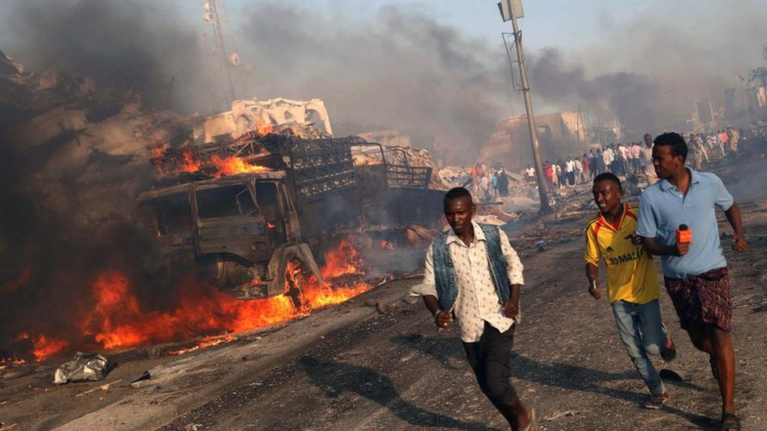

## Project Overview

Terrorism remains a critical threat to stability and security in Somalia, significantly affecting the local population and the broader regional context. This project aims to analyze the evolving trends of terrorism in Somalia, with a particular focus on the frequency, types, and impacts of attacks. By leveraging data-driven insights, this analysis intends to inform strategic responses to mitigate the effects of terrorism and enhance counterterrorism efforts across the region.

## Objective

The primary objective of this project is to conduct a comprehensive analysis of terrorism trends in Somalia, which includes:

- Identifying and quantifying the frequency of terrorist attacks over time.
- Analyzing the types of attacks and their geographical distribution.
- Understanding the casualties and impacts associated with various attack types.
- Providing actionable recommendations to enhance counterterrorism strategies based on the findings.

## Problem Statement

Over the past two decades, Somalia has witnessed a marked increase in terrorist activities, predominantly attributed to militant groups like Al-Shabaab. This persistent violence targets both military personnel and civilians, complicating the security landscape. The absence of a coordinated and effective counterterrorism strategy, coupled with a high frequency of attacks and considerable casualties, presents a multifaceted challenge for the Somali government and its international partners. A deeper understanding of attack patterns and trends is essential for formulating effective responses to alleviate the impacts of terrorism on society and development.

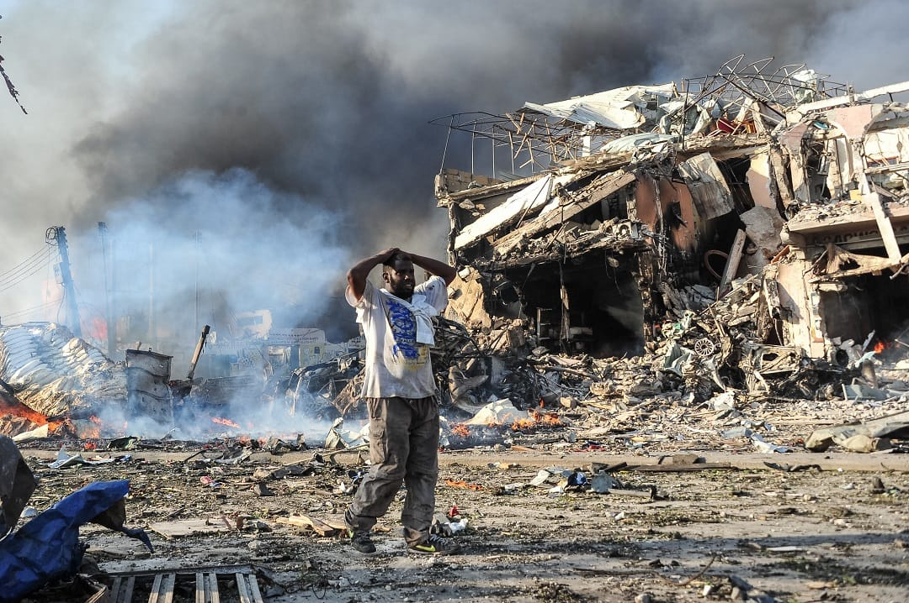

## Background

The surge of terrorism in Somalia is rooted in the collapse of the central government in the early 1990s, which created a power vacuum conducive to the rise of various militant factions. Al-Shabaab has been particularly notorious, executing numerous attacks against military, civilian, and infrastructural targets. The conflict is marked by alarming casualty rates, with peak years reporting over 3,000 fatalities. Analysis of monthly and weekly attack patterns reveals strategic planning by militants, with certain periods experiencing heightened violence.

The geographical concentration of attacks, especially in urban centers like Mogadishu, exacerbates security challenges, necessitating data-driven counterterrorism strategies. By examining historical data on terrorist incidents—including weapon types, attack methods, and target profiles—this project seeks to illuminate the underlying factors sustaining the threat of terrorism in Somalia.

### **Key Insights and Findings from the Analysis**

#### **1. Rise in Terrorist Attacks (1975–2020)**
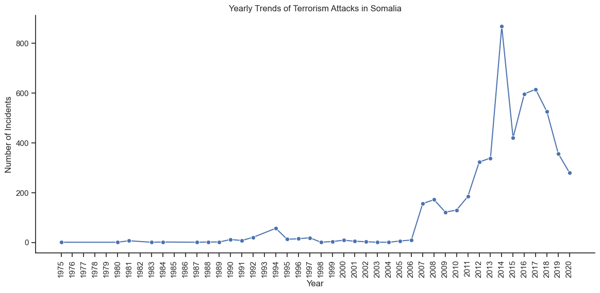
- Terrorist incidents in Somalia were minimal in the 1970s and 1980s but escalated dramatically in the 1990s. This surge coincided with Somalia’s civil war, the collapse of central governance, and the rise of extremist factions like Al-Shabaab.

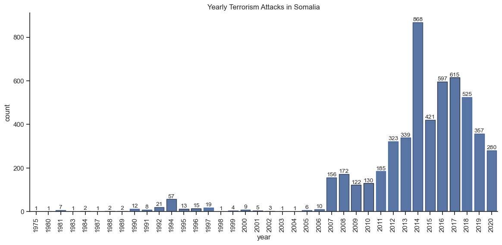

- **Peak in 2014:** The year 2014 saw an unprecedented spike in terrorist activity, with **over 800 attacks** recorded. Despite recent declines, the frequency of attacks remains significantly higher than in earlier decades.
  
**Reason:** The collapse of Somalia’s government in 1991 created a power vacuum, which extremist groups like Al-Shabaab exploited. By 2014, the conflict between these insurgents and the weak Somali government, backed by international forces, reached its height.

**Recommendation:** To reduce these attacks, continued efforts to stabilize Somalia's government and bolster national security forces are essential. Engaging local communities and empowering regional authorities could also play a key role in containing violence.

#### **2. Seasonal Patterns in Terrorism**
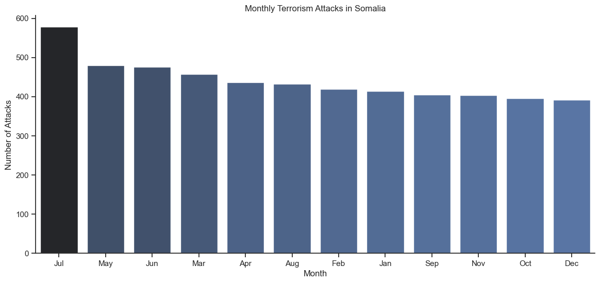
- **July sees the highest attacks:** Terrorism peaks in **July**, with more than **600 attacks** recorded. Other months like May and June also experience high levels of activity, while December sees relatively fewer attacks.
  
**Reason:** The spike in July may coincide with key political events or religious observances like Ramadan when extremist groups often intensify attacks for maximum psychological impact. Additionally, insurgents may strategically time attacks when security forces are stretched thin.

**Recommendation:** Intensify security efforts during high-risk months, particularly July. By forecasting patterns of attacks based on past data, Somali forces can proactively thwart planned operations.

#### **3. Weekly Attack Patterns**
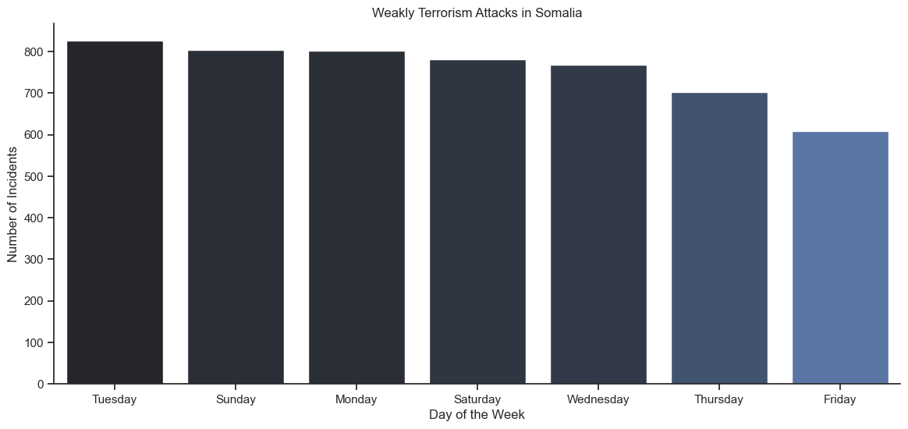
- **Tuesdays and Sundays are the most dangerous:** The highest number of terrorist attacks happen on **Tuesdays** and **Sundays**, while **Friday**—the day which is the Islamic weekend sees the fewest attacks.

**Reason:** Extremist groups may choose Tuesdays and Sundays for tactical reasons, such as catching security forces off-guard at the beginning of the work week or preparing attacks over the weekend. Fridays tend to have fewer incidents because of Friday prayers.

**Recommendation:** Reinforce security patrols and intelligence operations on high-risk days like Tuesdays and Sundays. Understanding these patterns allows security forces to focus their efforts on days when the threat is most severe.

#### **4. Regional Impact: Banaadir Leads in Attacks**
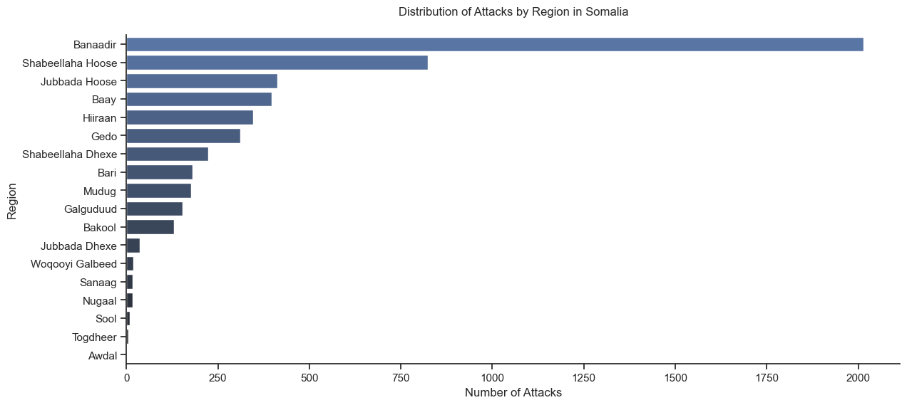
- **Banaadir region:** The capital region of **Banaadir**, which includes Mogadishu, experiences the majority of attacks—**over 1,900 incidents**. Other regions, like **Shabeellaha Hoose** and **Awdal**, face fewer attacks, with Awdal seeing only around **20 incidents**.

**Reason:** Mogadishu is not only the political and economic heart of Somalia but also the seat of government and international presence, making it a prime target for insurgent groups like Al-Shabaab. The contrast between urban hubs and rural or peripheral regions reflects insurgent priorities.

**Recommendation:** While Mogadishu needs continued security enhancements, rural areas should not be neglected. Building security infrastructure in smaller towns and regions can prevent militant groups from using these areas as sanctuaries.

#### **5. Urban vs. Coastal Areas**
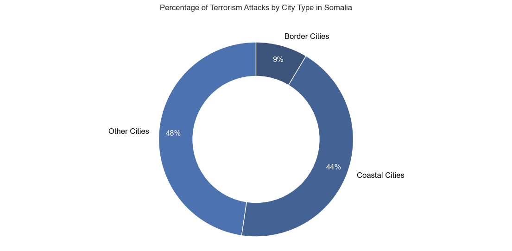
- **Coastal cities:** Account for **44%** of attacks, with urban centers like Mogadishu and Kismayo being particularly targeted. Border cities face fewer attacks (only **9%**).

**Reason:** Coastal cities like Mogadishu and Kismayo are strategic for extremists because they house key infrastructure like ports, which are vital for trade and insurgent smuggling. Border cities, while important, are often less populated or secure.

**Recommendation:** Coastal city security must remain a high priority. The Somali government should focus on securing key maritime routes and port cities to disrupt insurgent logistics, particularly in smuggling and illegal trade.

#### **6. Explosive Attacks Dominate**
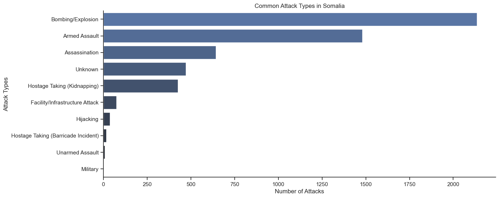
- **Bombings and Explosions** are the most frequent method of attack, with over **2,000 incidents** recorded, followed by **armed assaults**.

**Reason:** Explosives like **IEDs (Improvised Explosive Devices)** and **suicide bombings** are devastating in urban areas and allow extremists to inflict mass casualties while causing widespread fear. They’re also relatively inexpensive and easy to deploy in a conflict zone.

**Recommendation:** Investing in bomb detection technologies, training bomb squads, and promoting public vigilance can reduce the impact of these attacks. Additionally, the government should improve forensic capabilities to better trace the origin of explosives.

#### **7. High Civilian Casualties**

- **Bombing/Explosion** attacks cause the highest number of fatalities, resulting in over **13,000 deaths** since the late 1990s. Armed assaults also contribute significantly, with around **6,000 fatalities**.

**Reason:** Bombing tactics, especially in crowded urban areas like markets, government buildings, and hotels, maximize casualties. Al-Shabaab often targets civilians to create terror and erode public confidence in the Somali government.

**Recommendation:** Strengthening emergency response systems and providing public education on how to act during an attack could save lives. Security forces must focus on protecting civilian-heavy areas, particularly during high-risk periods.

#### **8. Surge in Suicide Bombings**
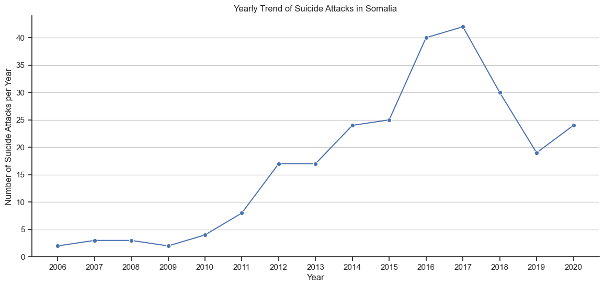
- **Suicide bombings** surged after 2011, peaking in 2017 with **over 40 attacks**. Despite a decline, they remain significantly higher than in the past.

**Reason:** Suicide attacks became a preferred method as Al-Shabaab and other extremists sought more destructive ways to attack highly fortified targets like government buildings, military bases, or international organizations.

**Recommendation:** Tracking the networks that facilitate suicide bombers—recruitment, radicalization, and logistical support—will be key in preventing future attacks. Intelligence services must work closely with local communities to detect early signs of radicalization.

#### **9. Use of Unknown Explosive Types**
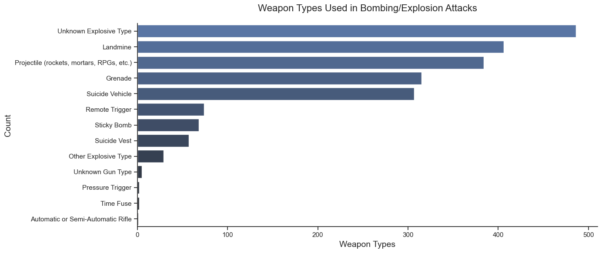
- The most commonly used weapons are **unknown explosive types**, followed by **landmines**, indicating a gap in tracking and identifying the exact materials used in attacks.

**Reason:** Somalia’s insurgents may be using a variety of homemade or black-market explosives that are difficult to trace. The frequent use of landmines reflects the ongoing threat in both urban and rural regions.

**Recommendation:** Improving forensic investigations and intelligence sharing among regional actors can help identify and cut off the supply chains for explosives. Training local police and military forces in explosive identification and neutralization will reduce casualties.

#### **10. Trends in Al-Shabaab Attacks**

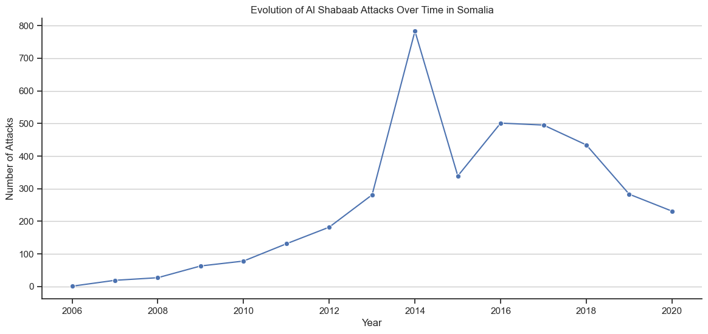
- **Overall Increase:** Since **2006**, there has been a marked rise in attacks attributed to Al-Shabaab, peaking in **2014** with over **800 incidents**. Although there has been a slight decline in recent years, current attack rates still surpass those observed in earlier decades.
  
**Reason:** The escalation of violence corresponds with Al-Shabaab's growing influence and operational capabilities, particularly during periods of instability and government weakness. 

**Recommendation:** Continuous efforts are needed to counter Al-Shabaab's recruitment and operational capabilities through enhanced community engagement and intelligence sharing among security forces.

#### **11. Weapon Usage in Attacks**

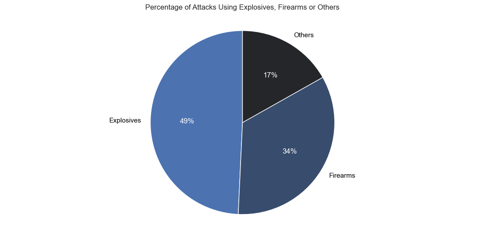
- **Explosives Dominance:** Explosives constitute the most frequently used weapon type in attacks, accounting for **49%** of all incidents, with firearms following at **34%**.

**Reason:** The accessibility and effectiveness of explosives in causing mass casualties in populated areas make them a preferred choice for militant groups. 

**Recommendation:** Security forces should focus on improving detection technologies and enhancing counter-explosive measures to mitigate the impact of explosive attacks.

#### **12. Prevalence of Suicide Attacks**

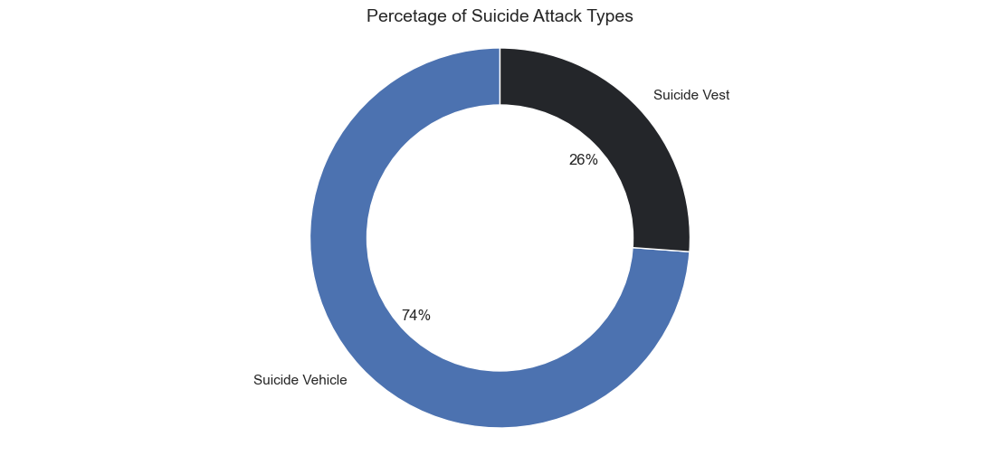
- **Suicide Vehicle Attacks:** An overwhelming **74%** of suicide attacks are executed using vehicles, while only **26%** utilize suicide vests.

**Reason:** Vehicle-based attacks enable larger explosive payloads and can target crowded locations, maximizing casualties and destruction.

**Recommendation:** Increased security measures around crowded public spaces and the monitoring of vehicle movements can help thwart potential attacks before they occur.

#### **13. Weapon Usage in Assassination Attacks**

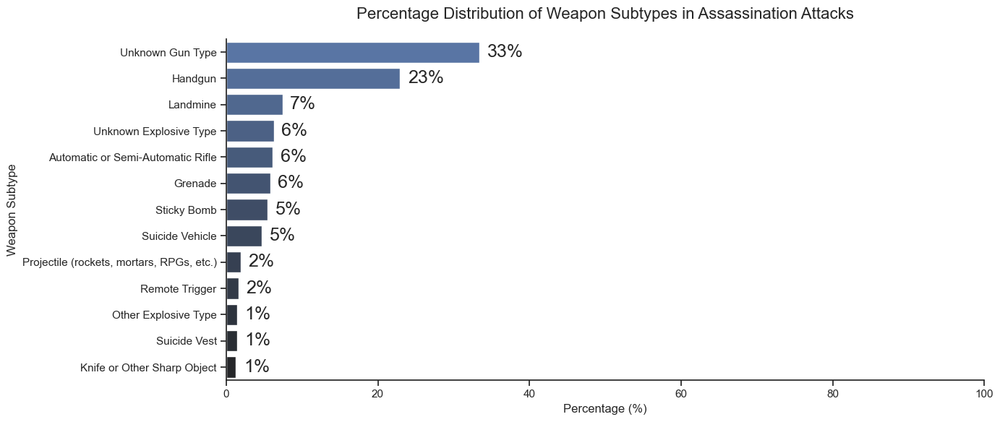
- **Common Weapons:** The most utilized weapons in assassination attacks are classified as **Unknown Gun Types** at **33%**, followed closely by handguns at **23%**.

**Reason:** The high percentage of unknown weapon types may stem from difficulties in identification during chaotic attack scenes or limited reporting capabilities.

**Recommendation:** Enhanced investigative protocols and training for local law enforcement can improve weapon identification and contribute to solving assassination cases more effectively.

#### **14. Regional Casualty Trends**

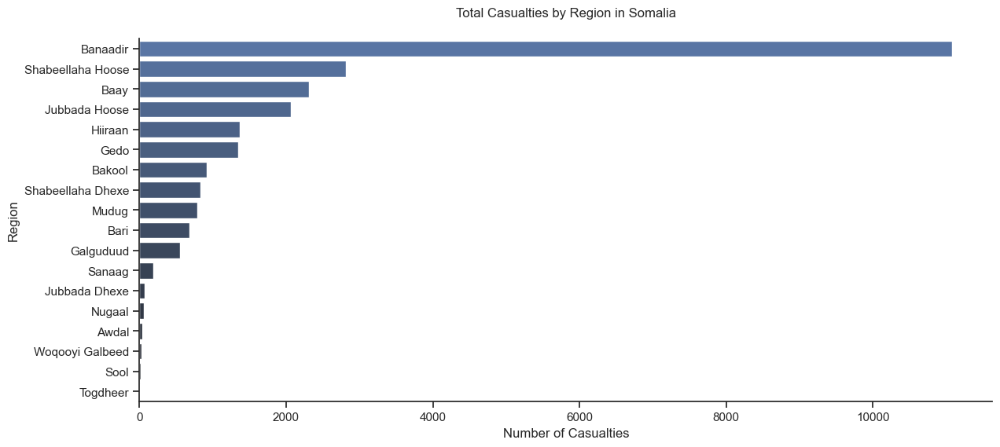
- **Banaadir Region Casualties:** The Banaadir region records the highest casualties, surpassing **10,000** fatalities, mainly due to the heavy concentration of militant activity in Mogadishu.

**Reason:** The capital’s political significance and urban density create a high-stakes environment where violent conflicts are more likely to occur.

**Recommendation:** Increasing the focus on security initiatives in urban centers while also reinforcing rural areas can help balance the overall security situation across Somalia.

#### **15. City-Specific Casualty Trends**

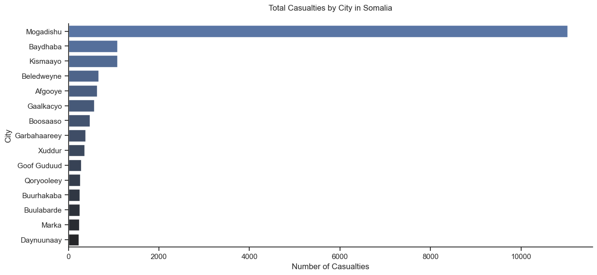
- **Mogadishu Impact:** As the capital, Mogadishu experiences the highest casualty counts, exceeding **10,000** fatalities attributed to its central role in the ongoing conflict.

**Reason:** The concentration of government institutions and international presence makes it a prime target for insurgents aiming to destabilize authority.

**Recommendation:** Sustaining and expanding security measures in Mogadishu is crucial, alongside fostering community resilience programs to reduce vulnerability to attacks.

#### **16. Casualty Outcomes of Attacks**

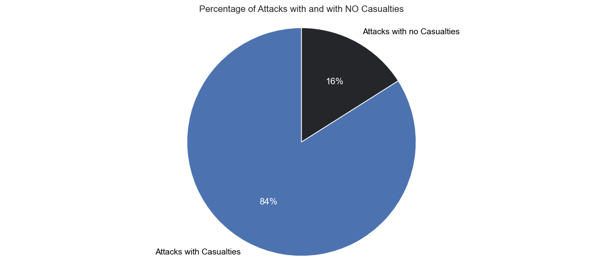
- **High Fatality Rate:** An alarming **84%** of terrorist attacks in Somalia result in casualties, emphasizing the lethal nature of the ongoing violence.

**Reason:** The frequent use of high-impact weapons like explosives and firearms inherently contributes to the elevated casualty rates observed.

**Recommendation:** Strengthening emergency response systems and public awareness campaigns can play vital roles in minimizing casualties during attacks.

#### **17. Trends in Deadly Attacks Over Time**

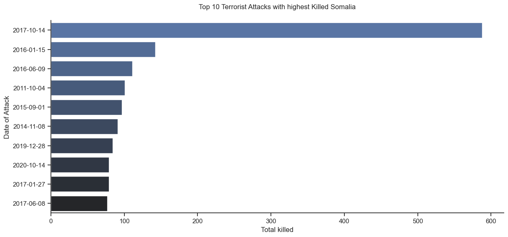
- **Post-2006 Surge:** The deadliest attacks have predominantly occurred after **2006**, with particularly high fatalities concentrated between **2011-2014** and again in **2017**.

**Reason:** The rise in deadly attacks correlates with the emergence and strengthening of extremist groups, such as Al-Shabaab, which have adopted increasingly violent tactics.

**Recommendation:** Continuous evaluation of counter-terrorism strategies is necessary to adapt to the evolving tactics employed by terrorist organizations and to effectively mitigate threats.

#### **18. Targeting Patterns in Hotel Attacks**

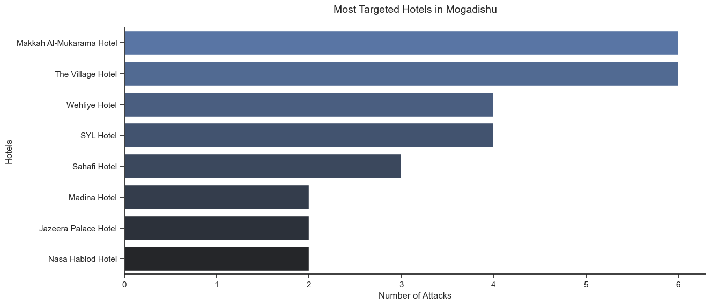
- **Frequent Targets:** Hotels such as the **Makkah Al-Mukarama Hotel** and **The Village Hotel** have seen the highest incidence of attacks, each experiencing **6 attacks**.

**Reason:** The popularity and central locations of these hotels make them attractive targets for insurgents seeking to create fear and garner media attention.

**Recommendation:** Improving security protocols at hotels, including surveillance and emergency response training, can help protect guests and deter potential attacks. 

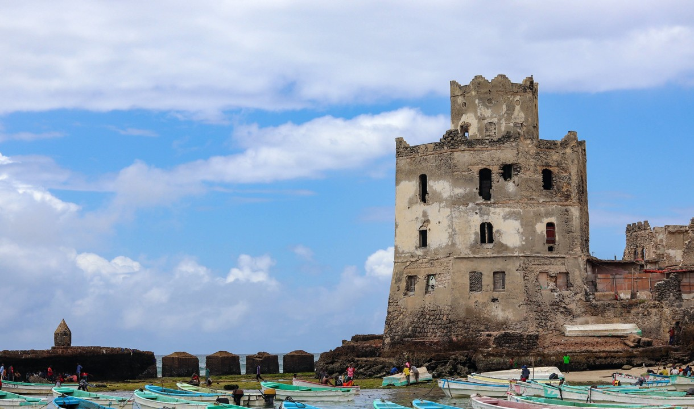

### Conclusion

The analysis of terrorism in Somalia presents a complex landscape characterized by evolving tactics, targeted regions, and significant impacts on civilian life. To address these challenges effectively, ongoing strategies must prioritize community engagement, enhance security measures, and bolster counterterrorism initiatives. These efforts are crucial in mitigating the threats posed by militant groups such as Al-Shabaab and fostering long-term stability in the region.
