# Analysis of Terrorism TrAttacks in Somalia

## Project Overview

Terrorism continues to pose a significant threat to stability and security in Somalia, impacting both the local population and broader regional dynamics. This project aims to analyze the evolving trends of terrorism in Somalia, focusing on the frequency, types, and impacts of attacks. By utilizing data-driven insights, this analysis seeks to inform strategic responses to mitigate the effects of terrorism and enhance counterterrorism efforts in the region.

## Objective

The primary objective of this project is to conduct a comprehensive analysis of terrorism trends in Somalia. This includes:

- Identifying and quantifying the frequency of terrorist attacks over time.
- Analyzing the types of attacks and their geographical distribution.
- Understanding the casualties and impacts associated with various attack types.
- Providing actionable recommendations for enhancing counterterrorism strategies based on the findings.

## Problem Statement

Somalia has experienced a significant increase in terrorist activities over the past two decades, with militant groups, particularly Al-Shabaab, perpetuating violence against military personnel and civilians alike. The lack of a coordinated and effective counterterrorism strategy, combined with a high frequency of attacks and substantial casualties, presents a complex challenge for the Somali government and its international partners. The insufficient understanding of attack patterns and trends hinders the ability to formulate effective responses to mitigate the impact of terrorism on society and development.

## Background

The rise of terrorism in Somalia can be traced back to the collapse of the central government in the early 1990s, leading to a power vacuum that facilitated the emergence of various militant groups. Al-Shabaab, in particular, has been responsible for numerous attacks targeting military personnel, civilians, and infrastructure. The conflict is characterized by high casualty rates, with over 3,000 fatalities reported in peak years. Monthly and weekly patterns of attacks reveal strategic planning by militants, with certain months and days witnessing higher incidences of violence.

The geographical concentration of attacks primarily in urban centers like Mogadishu further exacerbates the security challenges, making it imperative for stakeholders to develop informed, data-driven counterterrorism strategies. By analyzing historical data on terrorist incidents, including weapon types, attack methods, and target profiles, this project aims to provide insights into the factors contributing to the ongoing threat of terrorism in Somalia.

## Data-Driven Insights

### 1. Increase in Terrorism Incidents

- Terrorism in Somalia has surged since the late 1990s, peaking in **2014** with over **800 attacks**. While there has been a slight decline since then, current levels remain significantly higher than in previous decades.

### 2. Monthly Trends

- The month of **July** consistently records the highest number of attacks, followed closely by **May** and **June**. This indicates potential seasonal or political influences driving increased activity.

### 3. Weekly Patterns

- Attacks peak on **Tuesdays** and **Sundays**, while **Fridays** see the fewest incidents. This suggests strategic planning by militant groups to maximize impact.

### 4. Casualties
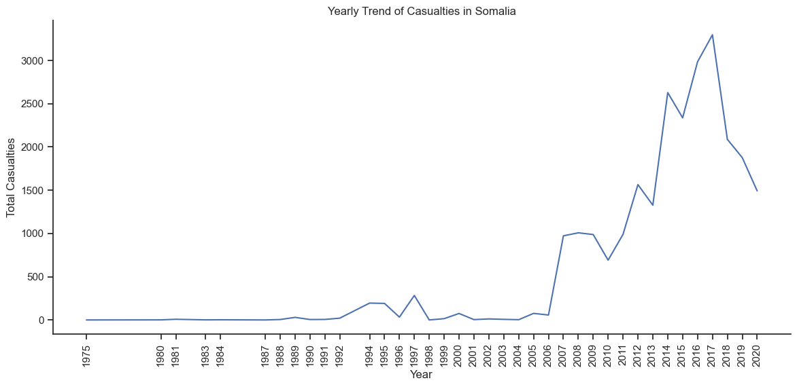
- Casualty rates have sharply increased, peaking in **2014** with over **3,000 fatalities**. Despite a decrease in recent years, casualty levels remain alarmingly high.

### 5. Geographical Concentration

- The **Banaadir** region accounts for the highest number of attacks, exceeding **1,900 incidents**, with **Mogadishu** alone reporting over **2,000**. Areas like **Awdal** experience significantly fewer incidents, highlighting regional disparities.

### 6. Attack Types

- Bombings and explosions are the most prevalent forms of attack, responsible for over **13,000 fatalities**. Armed assaults follow, accounting for around **6,000 fatalities**.

### 7. Suicide Attacks

- Suicide attacks have increased sharply since **2011**, peaking in **2017** with over **40 incidents**. Although there has been a slight decline, numbers remain higher than in previous years.

### 8. Weapons Used

- The most frequently used weapon is classified as **Unknown Explosive Type**, indicating a significant gap in the identification and tracking of explosives utilized in attacks.

## Key Insights

### 1. Higher Success Rate of Suicide Bombings
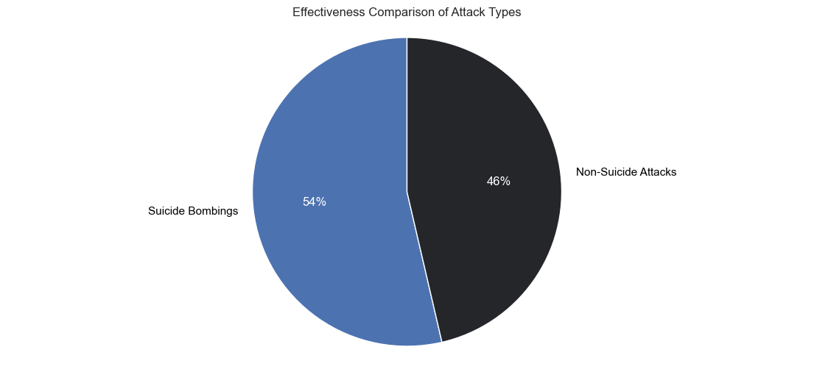
- Suicide bombings have a **54% success rate**, significantly higher than non-suicide attacks at **46%**. 
- **Implication:** The greater destructive capacity of suicide bombings necessitates targeted countermeasures.

### 2. Prevalence of Attack Types and Weaponry

- Firearms and explosives dominate the attack landscape, with **armed assaults**, **assassinations**, and **bombings** showing strong correlations.
- **Implication:** Enhanced security measures against firearms and explosives are essential.

### 3. Regional and Urban Concentration of Violence
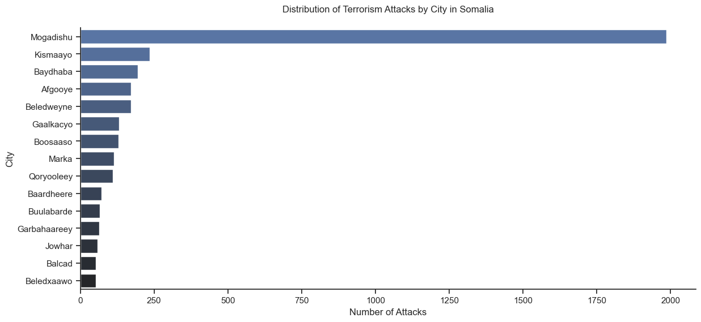
- The **Banaadir region** has the highest casualties, particularly in **Mogadishu**.
- **Implication:** Targeted interventions in urban centers are crucial to reducing violence.

### 4. High Frequency of Attacks on Hotels

- Frequent targets include the **Makkah Al-Mukarama Hotel** and **The Village Hotel**.
- **Implication:** Increased security around high-risk venues is critical for public safety.

### 5. Unsuccessful Attacks and Model Performance

- 84% of attacks result in casualties, indicating a high lethality rate.
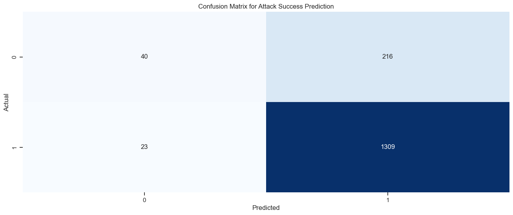
- **Model Insights:** The predictive model shows strong recall for successful attacks but struggles with unsuccessful ones.
- **Implication:** Improving prediction models can enhance early detection of potential threats.

### 6. Feature Importance in Casualty Prediction

- Features such as hostage-taking, attacks on businesses, and the use of explosives significantly impact casualty counts.
- **Implication:** Understanding these features can refine targeting in preventive strategies.

## Recommendations

### 1. Strengthening Counterterrorism Efforts

- **Focus on Suicide Attacks:** Increase intelligence efforts to monitor and disrupt potential suicide bombings, leveraging their higher success rates.
- **Targeted Interventions:** Allocate resources to urban centers like Mogadishu, which experience the highest levels of violence.

### 2. Enhancing Security Measures
- **Strengthen Hotel Security:** Implement robust security protocols at frequently targeted hotels to safeguard against potential attacks.
- **Gun Control and Explosive Monitoring:** Establish stricter regulations and monitoring systems for firearms and explosives to reduce their availability for terrorist activities.

### 3. Improving Data Collection and Analysis
- **Address Reporting Issues:** Enhance mechanisms for accurately identifying and reporting weapon types used in attacks to minimize the high proportion of “unknown” cases.
- **Utilize Feature Importance Insights:** Leverage insights from feature importance analysis to guide resource allocation and tactical planning for counterterrorism operations.

### 4. Refining Predictive Models
- **Enhance Model Training:** Implement techniques like class balancing and decision threshold adjustments to improve the model’s performance in predicting unsuccessful attacks.
- **Continuous Evaluation:** Regularly update and refine predictive models based on evolving tactics used by terrorist organizations.

### 5. Fostering International Cooperation
- **Collaborate on Intelligence Sharing:** Engage in partnerships with international agencies to share intelligence regarding weapon proliferation and counterterrorism strategies.
- **Joint Security Initiatives:** Work with neighboring countries to develop comprehensive security frameworks addressing cross-border terrorism threats.

### 6. Public Awareness Campaigns
- **Educate the Public:** Launch campaigns to educate citizens on recognizing suspicious activities and reporting them, promoting a culture of vigilance and cooperation with law enforcement.

The insights derived from the analysis of terrorism trends in Somalia underscore the complex challenges posed by militant groups, particularly Al-Shabaab. By focusing on targeted military operations, community engagement, and regional cooperation, stakeholders can enhance counterterrorism efforts and work toward restoring stability and security for the citizens of Somalia.

## Conclusion

The analysis of terrorism trends in Somalia reveals a complex and evolving security landscape marked by an increase in the frequency and severity of attacks, particularly by militant groups like Al-Shabaab. The insights derived from this project highlight the urgent need for enhanced counterterrorism measures, community engagement, and international cooperation to address the challenges posed by terrorism. By focusing on data-driven insights and actionable recommendations, stakeholders can work towards restoring stability and security in Somalia, ultimately improving the safety and well-being of its citizens.

## Visualizations
### **Targets**

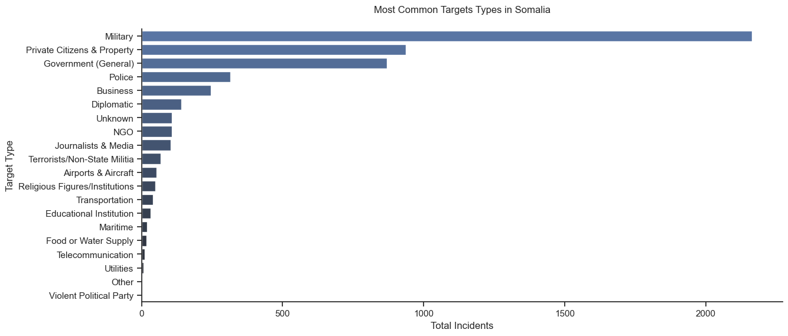

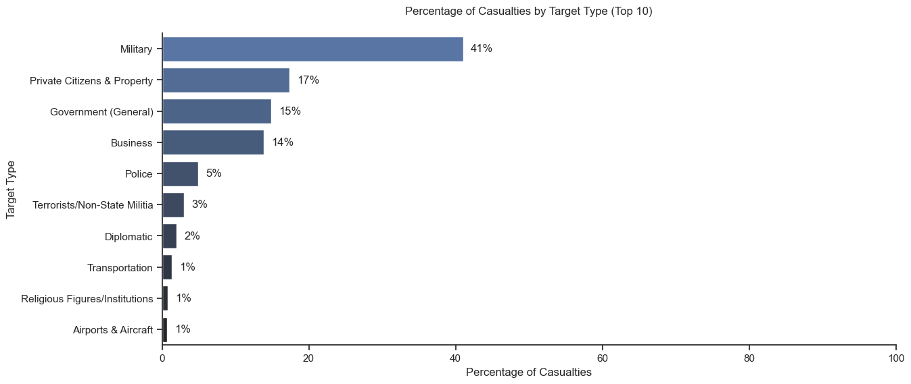

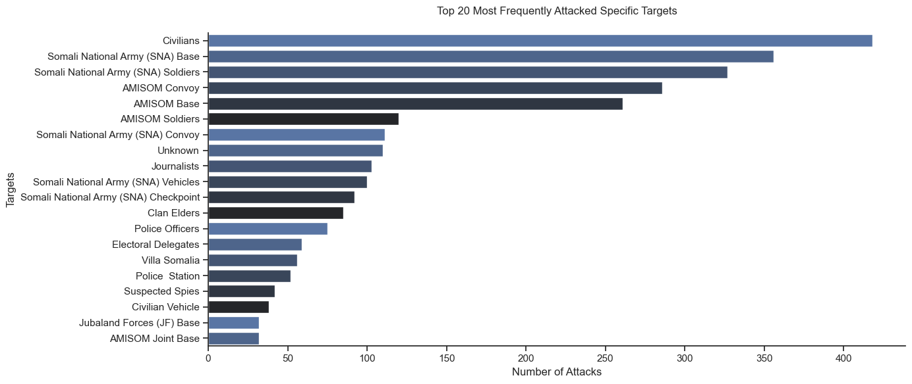

### **Effective Attack Methods**

### **Attack and Region Correlation**

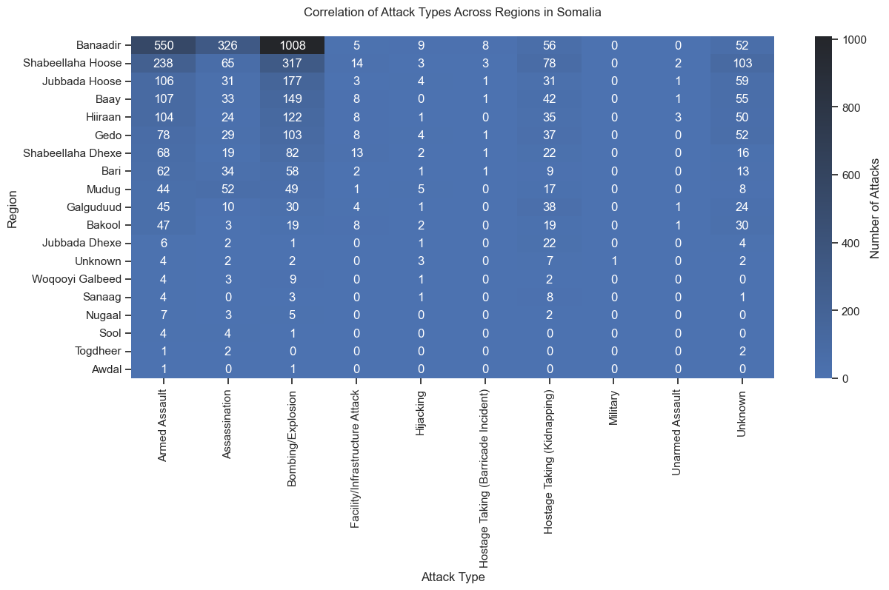

### **Weapon types used in Assassinations**

### **Common Attack Types**

### **Attacks with High Casualties**

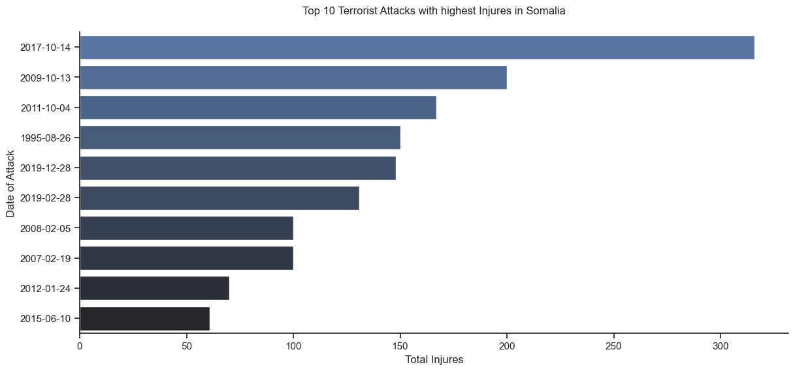

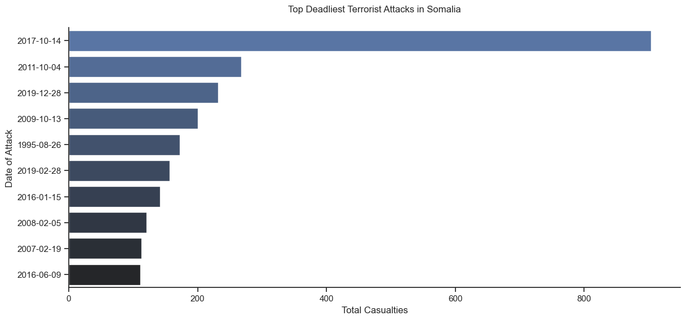

### **City type Attack percentage**

### **Monthly Suicide Attacks**

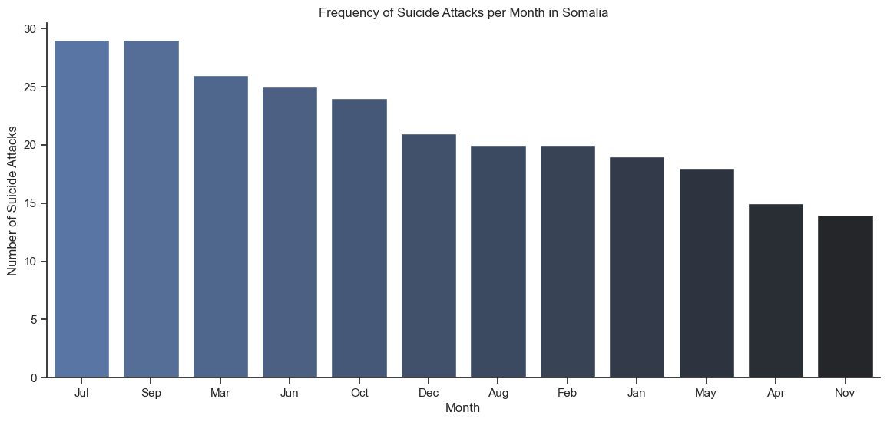